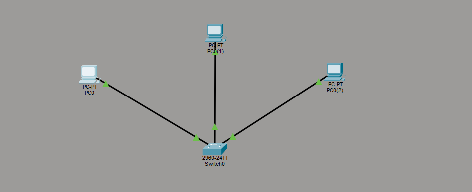
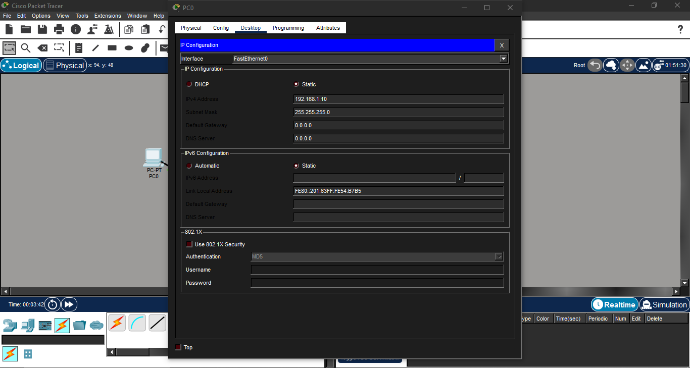
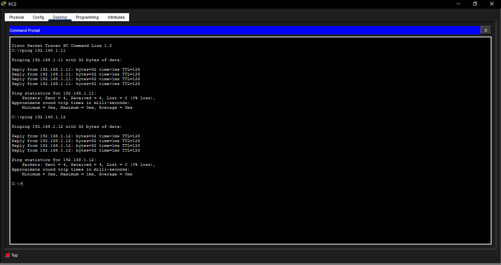

# Mini projet réseau — Cisco Packet Tracer

Projet réalisé dans le cadre d’une préparation à l’entrée en formation **Technicien Supérieur Systèmes & Réseaux (TSSR)**.

L’objectif de ce mini projet est de démontrer une première mise en pratique concrète des bases réseau à travers la création d’un réseau local simple sous **Cisco Packet Tracer**.

---

## Objectif

Créer un réseau local simulé avec plusieurs postes reliés à un switch, configurer des adresses IP statiques, puis vérifier la communication entre les machines à l’aide de tests de connectivité.

---

## Compétences mobilisées

- Adressage IP statique
- Configuration réseau de base
- Compréhension d’un réseau local simple
- Tests de connectivité avec `ping`
- Utilisation de **Cisco Packet Tracer**

---

## Architecture du projet

Le réseau est composé de :

- **1 switch**
- **3 postes (PC)**
- connexions Ethernet entre chaque poste et le switch

---

## Plan d’adressage

Les machines ont été configurées dans le même sous-réseau :

- **PC0** : `192.168.1.10`
- **PC1** : `192.168.1.11`
- **PC2** : `192.168.1.12`

Masque de sous-réseau utilisé :

- `255.255.255.0`

Sous-réseau :

- `192.168.1.0/24`

---

## Configuration IP statique

Chaque poste a été configuré manuellement avec une adresse IP statique.

Cette étape permet de comprendre la logique d’un réseau local simple et de préparer les tests de communication entre plusieurs machines.

---

## Test de connectivité

Des commandes `ping` ont été lancées pour vérifier que les machines communiquent correctement entre elles sur le réseau.

### Vérifications réalisées
- ping de `192.168.1.10` vers `192.168.1.11`
- ping de `192.168.1.10` vers `192.168.1.12`

### Résultat
Les réponses obtenues confirment que :

- les adresses IP sont correctement configurées
- les postes appartiennent au même réseau
- la connectivité via le switch est fonctionnelle

---

## Résultat obtenu

Le mini projet permet de valider les points suivants :

- création d’une architecture réseau simple
- configuration d’adresses IP statiques
- vérification de la communication entre plusieurs postes
- première mise en pratique des bases réseau

---

## Outils utilisés

- **Cisco Packet Tracer**
- **Windows**

---

## Rapport complet

Le rapport détaillé du projet est disponible en version PDF :

- [Rapport complet — version PDF](docs/rapport_complet.pdf)

---

## Suite prévue

Dans la continuité de ce travail, je prévois de poursuivre la révision des fondamentaux réseau :

- adressage IP
- DHCP
- VLAN
- NAT
- diagnostic réseau
- simulation réseau sous Cisco Packet Tracer
